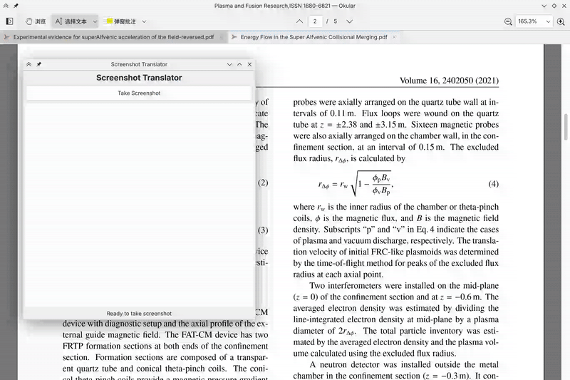

# Screenshot Translator

KDE Spectacle 截图翻译工具，支持 CLI 和 PyQt6 GUI 两种界面。使用 Gemini API 进行 OCR 和英译中，支持 Markdown 和 LaTeX 公式。

## 安装

### 方式一：pip 安装 (推荐)
```bash
# 安装 CLI 版本
pip install screenshot-translator

# 安装 GUI 版本 (包含额外依赖)
pip install screenshot-translator[gui]
```

### 方式二：从源码安装
```bash
git clone <repo-url>
cd pyqt_screanshot_translator

# 创建虚拟环境 (使用系统 PyQt6 包)
python -m venv --system-site-packages venv
source venv/bin/activate

# 安装Python依赖 (PyQt6使用系统包)
pip install -e .
```

### 系统依赖

- Python 3.7+
- KDE Spectacle (KDE Plasma 自带)
- libnotify (用于桌面通知)

```bash
# Arch Linux - 安装系统依赖
sudo pacman -S spectacle libnotify

# GUI 版本需要 PyQt6 (使用系统包)
sudo pacman -S python-pyqt6 python-pyqt6-webengine

# 验证安装
which spectacle
python -c "import PyQt6; print('PyQt6 available')"
```

## 配置

### 环境变量配置 (可选)

```bash
# API 配置
export TRANSLATOR_API_KEY="your-api-key"
export TRANSLATOR_BASE_URL="your-endpoint/v1"   # 默认: https://lpzgncibqfos.ap-southeast-1.clawcloudrun.com/v1
export TRANSLATOR_MODEL="model-name"             # 默认: gemini-2.5-flash
export TRANSLATOR_TEMP_PATH="/tmp/custom.png"   # 默认: /tmp/screenshot_translator_capture.png
```

### 快速测试配置
```bash
# 测试 API 连接
python -c "from screenshot_translator.translator import create_client; print('API client ready')"

# 测试截图功能
python -c "from screenshot_translator.screenshot import take_screenshot; print('Screenshot ready')"
```

## 使用方法

### CLI 版本
```bash
# 作为模块运行
python -m screenshot_translator.cli

# 安装后使用命令行工具
screenshot-translator-cli
```

### GUI 版本
```bash
# 作为模块运行
python -m screenshot_translator.gui

# 安装后使用命令行工具
screenshot-translator-gui
```

#### GUI 操作流程
1. **启动应用** - 运行后显示图形界面
2. **截图** - 点击 "Take Screenshot" 按钮
3. **选择区域** - 鼠标选择要翻译的屏幕区域
4. **等待处理** - 自动 OCR 识别和翻译
5. **查看结果** - Markdown 格式显示翻译结果

#### GUI 界面元素
- **截图按钮**: 主要操作按钮
- **进度条**: 显示处理状态
- **Markdown 显示区**: 支持 LaTeX 公式渲染
- **状态标签**: 当前操作状态

## 功能特性

- **双界面**: CLI 命令行和 PyQt6 图形界面
- **KDE 集成**: 使用原生 KDE 工具 (Spectacle, 桌面通知)
- **Markdown 支持**: 完整的 Markdown 渲染和语法高亮
- **LaTeX 公式**: MathJax 集成支持数学表达式
- **异步操作**: GUI 版本支持非阻塞处理
- **错误处理**: 完善的错误报告和用户反馈
- **环境变量配置**: 支持灵活的配置管理

## 演示

### GUI 版本演示



**演示说明**:
1. 启动 GUI 应用
2. 点击 "Take Screenshot" 按钮
3. 使用鼠标选择要翻译的屏幕区域
4. 等待 OCR 识别和翻译处理
5. 查看 Markdown 格式的翻译结果 (支持 LaTeX 公式渲染)

## 项目结构

```
├── screenshot_translator/     # 主包目录
│   ├── __init__.py           # 包初始化
│   ├── config.py             # 配置管理
│   ├── screenshot.py         # 截图功能
│   ├── translator.py         # 翻译API
│   ├── cli.py               # CLI入口
│   └── gui.py               # GUI入口
├── setup.py                 # 安装配置
└── README.md                # 本文档
```

### 方式三：AUR 安装 (Arch Linux)
```bash
# 使用 yay 或其他 AUR helper
yay -S screenshot-translator

# 或手动安装
git clone https://aur.archlinux.org/screenshot-translator.git
cd screenshot-translator
makepkg -si
```

## 开发

### 本地开发
```bash
git clone <repo-url>
cd pyqt_screanshot_translator

# 创建虚拟环境
python -m venv venv
source venv/bin/activate

# 安装开发依赖
pip install -e .[gui]

# 运行测试
python -m screenshot_translator.cli
python -m screenshot_translator.gui
```

### 构建包
```bash
# 构建 wheel 包
python setup.py bdist_wheel

# 构建源码包
python setup.py sdist
```

## 故障排除

### 常见问题

1. **模块导入错误**
   ```bash
   # 检查包是否正确安装
   python -c "import screenshot_translator; print('Package installed')"
   ```

2. **截图功能无效**
   ```bash
   # 测试 spectacle
   spectacle -r -b -n -o /tmp/test.png
   ```

3. **PyQt6 导入错误**
   ```bash
   # 检查系统 PyQt6
   python -c "import PyQt6; print('PyQt6 available')"
   ```

4. **翻译 API 错误**
   - 检查网络连接
   - 确认 API 配置正确
   - 查看终端错误信息

### KDE 全局快捷键设置

1. 打开系统设置 → 快捷键 → 自定义快捷键
2. 添加命令：`screenshot-translator-gui`
3. 设置快捷键组合